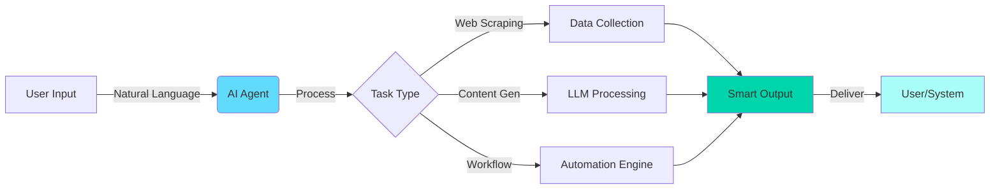

<div align="center">

<!-- Animated Header -->


<!-- Animated Wave -->


</div>

---

## 🚀 About Me

```typescript
const asad = {
    role: "Full-Stack Developer & AI Automation Engineer",
    code: ["JavaScript", "TypeScript", "Python"],
    askMeAbout: ["web dev", "AI automation", "LLM integration", "scalable systems"],
    technologies: {
        frontEnd: {
            frameworks: ["React", "Next.js"],
            styling: ["Tailwind CSS", "Framer Motion"],
            state: ["Redux", "Zustand", "Context API"]
        },
        backEnd: {
            runtime: ["Node.js", "Express"],
            databases: ["MongoDB", "PostgreSQL", "Prisma"],
            apis: ["RESTful", "GraphQL", "tRPC"]
        },
        aiAutomation: {
            llms: ["OpenAI GPT-4", "Anthropic Claude", "LangChain"],
            agents: ["AutoGen", "CrewAI", "LangGraph"],
            tools: ["Vector Databases", "RAG Systems", "Prompt Engineering"],
            integrations: ["Make.com", "Zapier", "n8n"]
        },
        devOps: ["Docker", "Vercel", "AWS", "CI/CD"],
        tools: ["Git", "Postman", "VS Code", "Cursor AI"]
    },
    currentFocus: "Building AI-powered web applications with autonomous agents",
    funFact: "I automate repetitive tasks so I can focus on solving real problems 🤖"
};
```

---

## 🎯 Core Expertise

<div align="center">

<table>
<tr>
<td align="center" width="50%">

### 💻 Full-Stack Development
Building scalable, performant web apps with modern frameworks and best practices

</td>
<td align="center" width="50%">

### 🤖 AI Automation
Creating intelligent workflows and AI-powered solutions that work 24/7

</td>
</tr>
</table>

</div>

---

## 🛠️ Tech Arsenal

<div align="center">

### Frontend Magic ✨


### Backend Power ⚡


### AI & Automation 🤖


### DevOps & Tools 🔧


</div>

---

## 🔥 Featured Projects

<div align="center">

<table>
<tr>
<td width="50%">

### 🛒 eStore - AI-Powered Commerce
**Smart eCommerce with Product Recommendations**

```yaml
Tech: React, Next.js, MongoDB, OpenAI API
Features:
  - AI product recommendations
  - Automated inventory alerts
  - Smart search with NLP
  - Admin analytics dashboard
  - Stripe payment integration
```

[](https://github.com)

</td>
<td width="50%">

### 🔐 AuthNext - Secure Auth System
**Next-Gen Authentication Platform**

```yaml
Tech: Next.js 14, Prisma, OAuth, JWT
Features:
  - GitHub/Google OAuth
  - Role-based access control
  - Session management
  - Email verification
  - 2FA support
```

[](https://github.com)

</td>
</tr>

<tr>
<td width="50%">

### 🤖 AI Workflow Automator
**Intelligent Task Automation Platform**

```yaml
Tech: Node.js, LangChain, OpenAI, n8n
Features:
  - Multi-agent coordination
  - Natural language workflows
  - RAG knowledge base
  - Scheduled automations
  - Webhook integrations
```

[](https://github.com)

</td>
<td width="50%">

### ✂️ CraftHub - Creator Platform
**Content Hub with AI Enhancements**

```yaml
Tech: React, Firebase, Cloudinary, AI
Features:
  - AI content suggestions
  - Auto-tagging with vision AI
  - Smart image optimization
  - Community features
  - Real-time collaboration
```

[](https://github.com)

</td>
</tr>
</table>

</div>

---

## 🎓 AI Automation Expertise

<div align="center">



</div>

### 🌟 Automation Capabilities

- **🔄 Workflow Automation**: Build complex multi-step automations with Make.com, Zapier, and custom scripts
- **💬 Chatbot Development**: Create intelligent conversational AI with context awareness
- **📝 Content Generation**: Automate content creation with fine-tuned prompts and templates
- **🔍 Data Processing**: Extract, transform, and analyze data using AI-powered pipelines
- **🎯 Lead Generation**: Build automated prospecting systems with AI qualification
- **📧 Email Automation**: Smart email sequences with personalization at scale

---

## 💡 What I'm Building

<div align="center">

| 🎯 Current Focus | 📚 Learning | 🔮 Exploring |
|------------------|-------------|--------------|
| AI-powered SaaS platforms | Advanced RAG systems | Multi-modal AI agents |
| LangChain applications | Vector databases optimization | Edge AI deployment |
| Autonomous agent frameworks | Fine-tuning LLMs | Web3 + AI integration |

</div>

---

## 🌐 Connect With Me

<div align="center">

[](https://linkedin.com/in/asad-ghafar)
[](https://asad-ghaffar.vercel.app/)
[](mailto:r.asadghaffar8800@gmail.com)

</div>

---

<div align="center">

### 💭 Developer Wisdom


---

### 🐍 Contribution Snake


---

</div>
